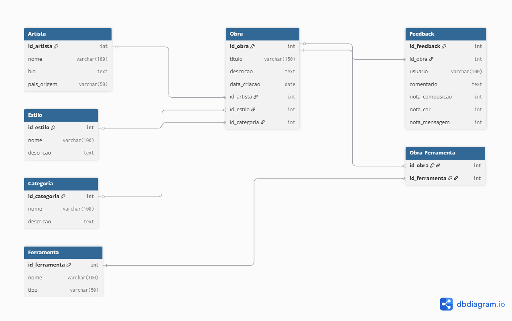

## 👥
- Emanoel Genez de Souza
- Guilherme de Andrade Santos
- Guilherme Ribeiro Guimarães
- Hugo Leonardo Veloso de Sales
- Wendler José da Silva

# Plataforma de Análise e Produção de Arte Digital

>
> “Você já parou para pensar no que torna uma obra de arte *realmente* valiosa?”
>
> Não falamos apenas de dinheiro — mas de presença, emoção, impacto.  
> 
> Em um mundo onde imagens são geradas por inteligência artificial em segundos e obras digitais são vendidas por milhões em NFTs, como organizamos, entendemos e valorizamos a arte?  
>
> Este projeto nasceu dessa inquietação.  
>
> Em conversas com amigos criadores, vimos artistas brilhantes lutando para documentar seu trabalho, entender sua audiência ou simplesmente escolher a melhor ferramenta para criar.  
>
> Foi então que decidimos transformar essa dor em solução: uma plataforma de análise e produção de arte digital. Um banco de dados que não só organiza informações, mas **cria inteligência**, conecta contextos, e valoriza a trajetória artística em tempos de algoritmos e pixels.
>
> Esta não é apenas uma estrutura técnica. É uma ponte entre o humano e o digital. Entre o que se sente e o que se mede.

## 🧠 Contexto e Visão Científica
O projeto **Plataforma de Análise e Produção de Arte Digital** surge em meio à crescente convergência entre arte, tecnologia e cultura digital. Vivemos na era da **economia figital** (física + digital), onde bens simbólicos (como imagens, músicas e experiências) ganham valor econômico concreto por meio de sua circulação em redes digitais, marketplaces de NFTs, redes sociais, IA generativa e plataformas criativas.

Nesta realidade, artistas independentes, curadores, críticos e desenvolvedores culturais precisam lidar com **dados complexos** sobre obras, ferramentas digitais, estilos artísticos e percepção pública.

> Este projeto propõe um banco de dados relacional que organiza e analisa esses elementos de forma integrada, abrindo espaço para aplicações reais na gestão, curadoria e inteligência de mercado para arte digital e fotojornalismo.

## 🎯 Objetivo do Projeto
Criar uma base de dados relacional normalizada para registro e análise de:

- Obras de arte digital e fotojornalismo  
- Artistas e seus perfis  
- Estilos e categorias  
- Ferramentas utilizadas (ex: IA, software, hardware)  
- Feedback do público (com métricas subjetivas)

Esse sistema pode ser utilizado por plataformas de arte, marketplaces digitais, comunidades criativas ou para fins acadêmicos e analíticos.

## 🛠️ SGBD Utilizado
**SQLite**, por sua simplicidade e portabilidade no desenvolvimento inicial.

## 📁 Estrutura do Projeto

| Arquivo         | Descrição                                                                 |
|-----------------|---------------------------------------------------------------------------|
| `schema.sql`    | Criação das tabelas normalizadas com chaves primárias e estrangeiras      |
| `data.sql`      | População de dados fictícios realistas com artistas, estilos, obras, etc. |
| `queries.sql`   | Consultas SQL relevantes ao contexto                                       |
| `img/diagrama.png` | Diagrama ER do banco de dados                                          |

### 📌 Modelo Conceitual (ER)

Principais entidades e relacionamentos:

- `Artista` (1:N com `Obra`)  
- `Estilo` (1:N com `Obra`)  
- `Categoria` (1:N com `Obra`)  
- `Ferramenta` (N:N com `Obra` via `Obra_Ferramenta`)  
- `Obra` (1:N com `Feedback`)

O modelo foi desenvolvido seguindo boas práticas de normalização (até 3FN), com o uso de chaves estrangeiras, constraints e entidades associativas para resolver relacionamentos complexos.

## 🔎 Exemplos de Consultas SQL

- Top 3 obras com melhor avaliação de mensagem  
- Lista de artistas com mais obras produzidas  
- Estilos mais utilizados  
- Ferramentas mais empregadas na produção  

## 📊 Análise Competitiva e Tecnologias Disruptivas

Este projeto se insere em um ecossistema onde plataformas como **DeviantArt**, **OpenSea**, **ArtStation** e ferramentas como **Midjourney** moldam novas formas de produção e consumo estético.

O banco de dados proposto pode ser usado como base para:

- Dashboards de performance e engajamento  
- Relatórios e análises sobre comportamento do público  
- Ferramentas preditivas para curadoria e recomendação artística

Além disso, o uso de tecnologias como:

- IA generativa (Stable Diffusion, DALL·E, Runway)  
- Blockchain (NFTs)  
- Algoritmos de recomendação e análise semântica  

… estão transformando o valor simbólico da arte na economia contemporânea.

## 🧩 Relevância Filosófica e Social

A arte digital é uma linguagem da contemporaneidade. Reflete os paradoxos da sociedade conectada, como:

- A diluição entre criador e espectador  
- A fusão entre humano e algoritmo  
- A fluidez entre o tangível e o digital  

> Este projeto, ao organizar dados sobre essas dinâmicas, contribui para a discussão sobre **o futuro da criatividade, da autoria e da expressão na era figital**.

## 🚀 Perspectivas Futuras

- Geração de relatórios automatizados com Python/Power BI  
- Integração com APIs de IA generativa (ex: geração de arte)  
- Sistema web com upload de obras e coleta de feedbacks  
- Publicações analíticas sobre a produção artística digital brasileira  
